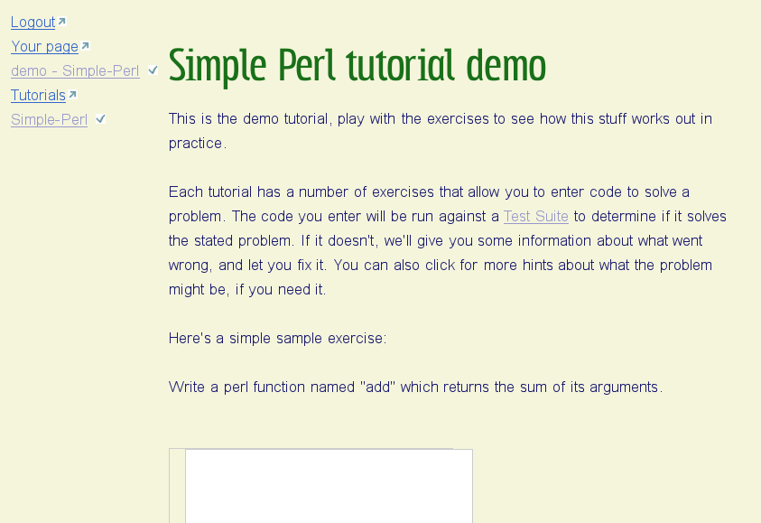
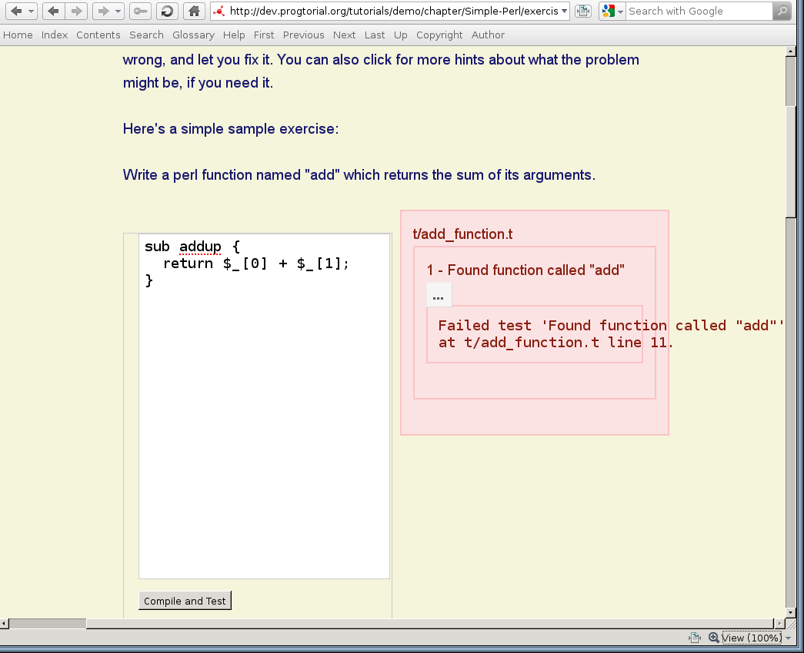
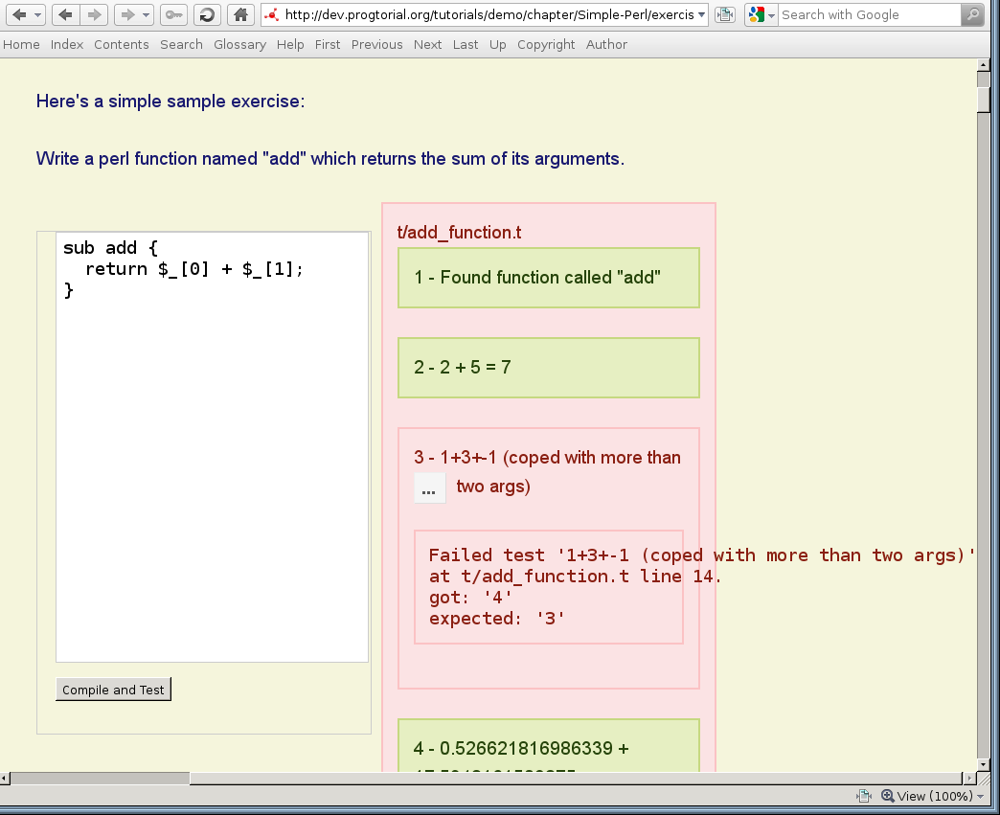
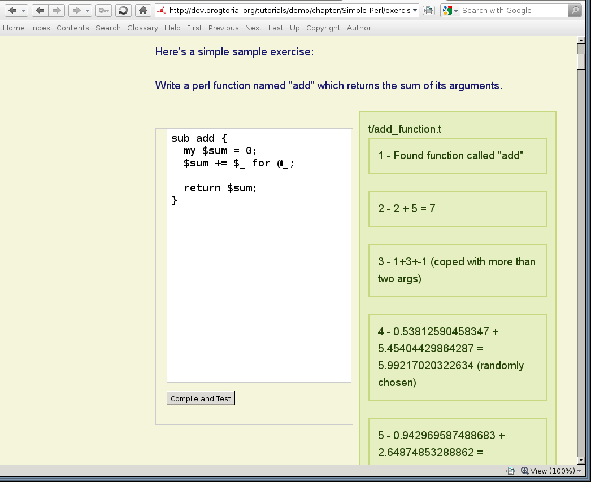

% Look ma, no installing!
% Jess Robinson
% London Perl Workshop, Dec 2010

# DBIx::Class Tutorial

- Invented to teach co-workers
- Put on CPAN, but pretty basic
- Started upgrading, with real-world application example, never released
- Gets used anyway, google finds it

# Answering IRC questions

- Lots of IRC questions 
- Generally "solve this problem I'm stuck on"
- Help by thwacking with a fishing rod, not giving fish

# Docs good, but dry

- Documentation can be good, but often needs lots of examples
- Only tells one layer of the story, usually a reference to available classes/methods
- Even a tutorial only tells one angle

# Need interactive tutorials

- Replace some of the standard questions
- Try it out for yourself, no installing required
- Catalyst web frontend
- chroot'd environment backend
- Solve exercises == passing unit tests!

# Demo

----

----

----

# Other / Contribute

- Obligatory social media add-ons, friending, openid, comments etc.
- [http://github.com/castaway/progtorial]
- [http://twitter.com/progtorial]

